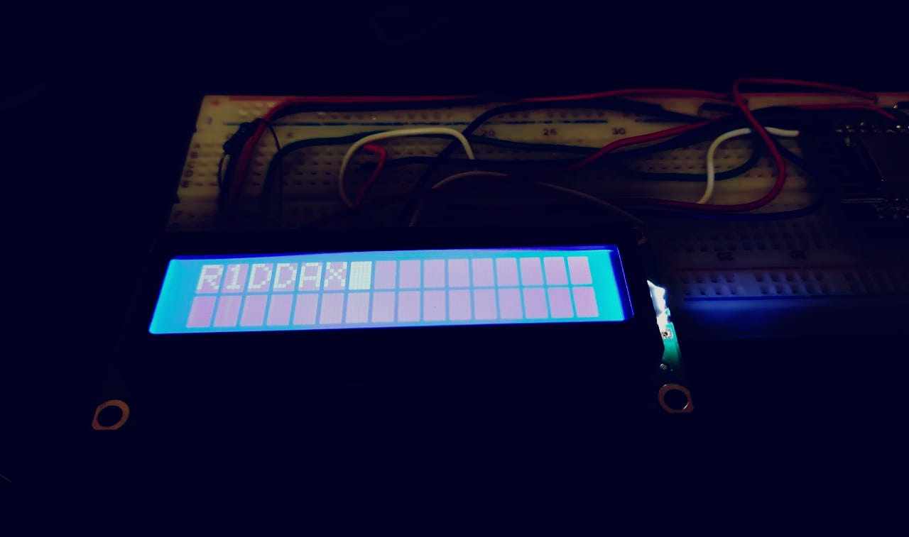
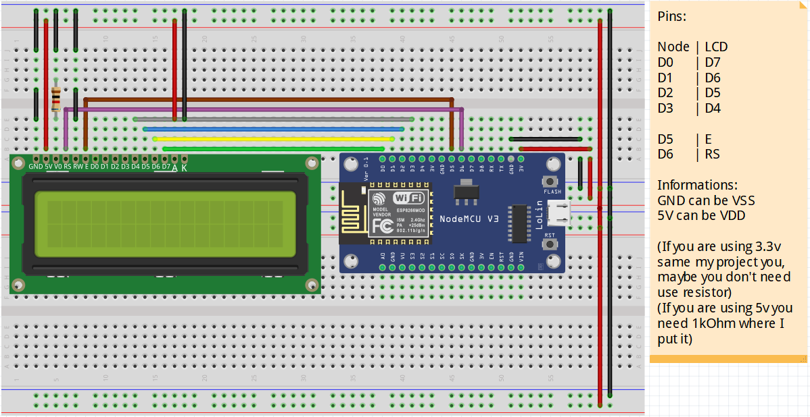

<p><h1 align="center"><a href="#" target="_blank"></a></h1>
<p align="center">
  <a href="#" target="_blank"></a>
  <a href="#" target="_blank"></a>
  <a href="#" target="_blank"></a>
</p>

<h4 align="center"\>This repository is a study repository to implement the LCD 16x2 in my project below.</p>

<a href="https://github.com/r1ddax/punch_the_clock" target="_blank"></a>
</br>
<a href="https://github.com/r1ddax/punch_the_clock" target="_blank"></a>

</br>


## Index
<p align="center">
:small_blue_diamond: <a href="#about" target="_blank">About</a></br>
:small_blue_diamond: <a href="#functionalities" target="_blank">Functionalities</a></br>
:small_blue_diamond: <a href="#deploy" target="_blank">Deploy</a></br>
:small_blue_diamond: <a href="#requirements" target="_blank">Requirements</a></br>
:small_blue_diamond: <a href="#pinout" target="_blank">Pinout</a></br>
:small_blue_diamond: <a href="#running" target="_blank">Running</a></br>
:small_blue_diamond: <a href="#tasks" target="_blank">Tasks</a>
</p>

## About
This code aims to help people to study writing on lcd 16x2 and to implement the 4-bit mode easily to my project punch_the_clock.

## Functionalities
:heavy_check_mark: Initialize the LCD to work in the 4-bit mode. </br>
:heavy_check_mark: Write on LCD. </br>
:heavy_check_mark: Send command to LCD. </br>
:heavy_check_mark: Clear LCD. </br>

## Deploy


## Requirements
I did (digitalWrite) using <Arduino.h> library, it isn't really necessary, but if you want use my current code it is important.

## Running
Just clone this repository, change the lcd pin to your settings and compile.

Clone this repository
```
git clone https://github.com/r1ddax/LDC-16x2.git
```

## Pinout


## Tasks

:memo: Read and analyze the datasheet. </br>
:memo: Import data of datasheet to logic programming. </br>
:memo: Code initializing system 4-bits. </br>
:memo: Code the 'write function' to send commands/characters using 4-bits mode. </br>
